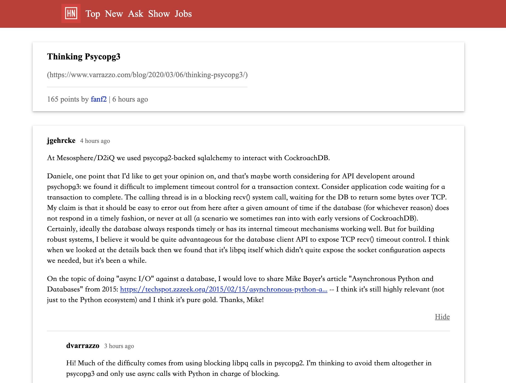

## Project angular-hacker-news
This has been developed as a practice project in order to get familiar with Angular and its relevant front-end technology stack.

The whole project has been developed using Angular v9 and CSS. It also includes RxJS library as a
 replacement of Promise. HTTP GET requests are sent through e.g. "https://hacker-news.firebaseio.com/v0/item/2921983.json?print=pretty".
 
For more information about HackerNews API, please visit [here](https://github.com/HackerNews/API).

---

## Setup

Clone this repo to your desktop and run `npm install` to install all the dependencies.

---

## Usage

Once the dependencies are installed, you can run `ng serve --open` to start the application.

App will be live at `localhost:4200`

---

## License

This project is licensed under the terms of the **MIT** license.

---
